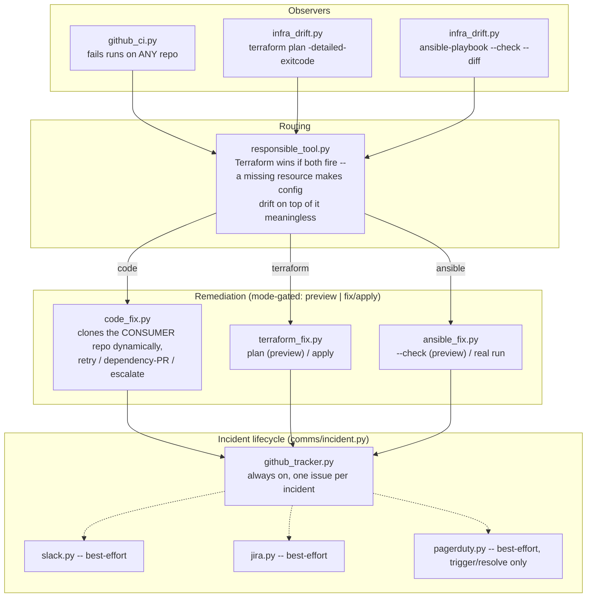

# aiops-remediation-agent

Generalizes [`self-healing-cicd`](https://github.com/vishalrath0d/self-healing-cicd)'s
real Observe → Triage → Remediate → Verify loop two ways: it operates on *any*
consumer repo it's pointed at (not just itself), and it routes a problem to
whichever tool is actually responsible for fixing it — code, Terraform, or
Ansible — instead of only ever knowing how to touch CI/CD.

Every remediation action carries an explicit execution mode. `preview` (the
default, always safe) shows exactly what would happen — a real Terraform-plan
diff, a real Ansible `--check` diff, or a description of the exact PR/retry/
issue that would be opened — without touching anything. `fix` (code) / `apply`
(infra, config) actually does it. Nothing here ever mutates state without an
explicit, per-run opt-in.

### Contents
- [Why this exists](#why-this-exists)
- [Architecture](#architecture)
- [The demo target](#the-demo-target)
- [Execution modes](#execution-modes)
- [Comms](#comms)
- [Quick start](#quick-start)
- [Verified: a real end-to-end run](#verified-a-real-end-to-end-run)
- [Known limitations / honesty notes](#known-limitations--honesty-notes)

## Why this exists

`self-healing-cicd` proved the core loop for real, but at a narrow scope: one
repo, watching only its own CI, fixing only code. This project asks the
bigger question that idea always implied — what does the same loop look like
when the target isn't yours, and the problem isn't always in the code at all?
Every piece below is built to answer that for real, not just describe it.

## Architecture



`agent/importer/` (repos, Terraform state, Ansible inventory) is a separate,
read-only discovery path — catalogs what exists, doesn't itself enroll
anything into the watch loop above. See [Known limitations](#known-limitations--honesty-notes).

## The demo target

`demo_infra/` is a real, live target for the infra + config path — no cloud
account, no cost, no credentials, using local Docker as a safe stand-in:

- `demo_infra/terraform/` — the `kreuzwerker/docker` provider launches a real
  running local container (`aiops-demo-instance`), standing in for a cloud
  instance (e.g. EC2).
- `demo_infra/ansible/` — `community.docker`'s connection plugin execs
  directly into that container (no SSH, no keys) and configures a real user
  account + config file on it.

This is the exact two-tool split the responsible-tool router exists to
recognize: Terraform provisions, Ansible configures, and neither is allowed
to do the other's job. Point `terraform_dir`/`ansible_inventory` at a real
cloud target later and the remediation engine needs zero code changes — only
the target changes.

## Execution modes

| Domain | Preview (default, always safe) | Real execution |
|---|---|---|
| Code | `preview` — describes the retry/PR/issue it would take | `fix` |
| Terraform | `preview` — real `terraform plan` | `apply` — real `terraform apply` |
| Ansible | `preview` — real `ansible-playbook --check --diff` | `apply` — real run |

```bash
python -m agent.cli code  run-once --repo OWNER/NAME --tracker-repo OWNER/TRACKER --code-mode preview
python -m agent.cli infra run-once --tracker-repo OWNER/TRACKER --infra-mode apply
```

## Comms

Every incident (`agent/comms/incident.py`) moves through an explicit phase
state machine — `detected → diagnosing → fix_proposed → applied → verified →
resolved`, or `escalated` from any non-terminal phase — and every phase
transition fans out to whichever backends are configured:

- **GitHub** (`github_tracker.py`) — always on, no config needed beyond the
  `gh` auth everything else here uses. One real issue per incident, a real
  comment on every phase change, closed only on `resolved` (**not** on
  `escalated` — see [Verified](#verified-a-real-end-to-end-run) for the real
  bug that got this backwards on the first live run).
- **Slack, Jira, PagerDuty** — real client code against each service's own
  documented API (Slack Web API `chat.postMessage`/`chat.update` editing the
  same message in place; Jira Cloud REST v3, comment-per-event + best-effort
  status transition; PagerDuty Events API v2, trigger/resolve only — an
  escalation-only tool by design, not wired to every phase). Env-var gated
  (`SLACK_BOT_TOKEN`/`SLACK_CHANNEL_ID`, `JIRA_URL`/`JIRA_EMAIL`/
  `JIRA_API_TOKEN`, `PAGERDUTY_ROUTING_KEY`) and best-effort: disabled
  silently if unconfigured, and a failure inside any of them is caught and
  logged, never raised into the caller — a Slack/Jira/PagerDuty outage must
  never stop real remediation work.

  This pattern — generic env-var gating, "never block the core flow on a
  downstream integration failure," comment-per-lifecycle-event — is
  generalized from a real, production Slack-based GitLab access-request bot
  (private, company-internal, not a public repo) with a Jira mirror, without
  copying its company-specific Jira custom-field IDs, which are meaningless
  outside that one Jira instance's exact screen scheme.

## Quick start

Requires `gh` (authenticated), `terraform`, `ansible-playbook`, and Docker.

```bash
git clone https://github.com/vishalrath0d/aiops-remediation-agent
cd aiops-remediation-agent
python3 -m venv .venv && .venv/bin/pip install -r requirements.txt

# Stand up the real local demo target:
cd demo_infra/terraform && terraform init && terraform apply -auto-approve && cd -

# Break it on purpose, then watch the agent find and fix it:
.venv/bin/python -m agent.cli trigger-config-drift
.venv/bin/python -m agent.cli infra run-once --tracker-repo YOUR_OWNER/aiops-remediation-agent --infra-mode preview
.venv/bin/python -m agent.cli infra run-once --tracker-repo YOUR_OWNER/aiops-remediation-agent --infra-mode apply
```

```bash
.venv/bin/pytest tests/ -v   # 31 tests, all offline
```

## Verified: a real end-to-end run

Every path below was run for real, live — not simulated:

**Demo target, standalone, before any agent code touched it**: real
`terraform apply` created a real running container; real `ansible-playbook`
created a real user + config file on it; a second run confirmed idempotency
(`changed=0`).

**Infra path (Terraform)**: `trigger-infra-drift` really destroyed the
container. `infra-mode preview` correctly routed to `terraform` (not
`ansible`) and showed a real create plan, touching nothing. `infra-mode
apply` really recreated it. Re-verified clean afterward.

**Config path (Ansible)**: `trigger-config-drift` really removed the user +
config file. `preview` correctly routed to `ansible` and showed the real
diff. `apply` really fixed it; re-verified clean.

**Cross-repo code-fix**: a real failure was triggered in `self-healing-cicd`
(a repo this agent doesn't own). `code-mode preview` correctly triaged it
without touching anything. `code-mode fix` opened a real PR:
[self-healing-cicd#4](https://github.com/vishalrath0d/self-healing-cicd/pull/4) —
and, checked directly afterward, the *original* local `self-healing-cicd`
clone was untouched, still on `main`. This is a genuine improvement over
`self-healing-cicd` itself, which mutates whatever local clone it's run
from — this project clones the consumer repo into its own scratch directory
instead, verified live to leave the caller's working directory alone.

**Comms**: the GitHub tracker created and updated real issues throughout
(13 total across this verification pass; the exploratory/superseded ones
were closed afterward with an explanation, left visible rather than deleted).
Slack/Jira/PagerDuty are real client code, not live-verified — no test
workspace was available in the environment this was built in.

**Four real bugs found and fixed during this pass** (all in
`fc51aac`, pushed):
1. **`github_tracker.py` closed the issue on `ESCALATED`** — backwards,
   since escalating means "a human needs to look at this." Found live: the
   very first run (issue #1) closed itself immediately on a preview-only
   outcome. Fixed: only `RESOLVED` closes an issue now.
2. **A failed Ansible run was misread as "no drift."** `check_ansible_drift`
   checked whether `"changed="` appeared in the output — but the PLAY RECAP
   line always contains a `changed=` count, including `changed=0` on a run
   that outright *failed* for an unrelated reason. Fixed to check the real
   process exit code instead of substring-matching a human summary line.
3. **The demo playbook's Python-bootstrap task is skipped under
   `--check`** — Ansible's documented default behavior for `raw` tasks —
   which cascaded into every later task failing on a freshly-recreated
   container (no interpreter yet). This is what actually triggered bug 2.
   Fixed with `check_mode: false` on that one bootstrap task.
4. **`git -C clone_path add <path>` resolved `<path>` relative to
   `clone_path`, not the caller's cwd** — but the path handed to it was
   already `clone_path`-prefixed, so git looked for it doubly-nested and
   failed (exit 128). Found on the first real cross-repo fix attempt.
   Fixed by relativizing the path before passing it to git.

## Known limitations / honesty notes

- **Slack/Jira/PagerDuty are real, correct client code against each
  service's documented API — not live-verified.** No test workspace was
  available in the build environment. If you have one, set the relevant env
  vars and the exact same code path runs for real with zero changes.
- **Import is discovery-only.** `import repos`/`terraform-state`/
  `ansible-inventory` catalog what exists; nothing here automatically
  enrolls a discovered repo/resource into the watch loop. A real next step,
  not silently pretended-away.
- **`demo_infra` targets local Docker, not a real cloud account** — by
  design (see [Why this exists](#why-this-exists) and
  [`terraform-aws-toolkit`](https://github.com/vishalrath0d/terraform-aws-toolkit)'s
  own README for why: the AWS credentials available while building this
  portfolio are explicitly off-limits for any use). The remediation engine
  itself doesn't know or care that the target is local — pointing
  `terraform_dir`/`ansible_inventory` at a real backend later needs no
  engine changes.
- **The fast-path triage regex is tuned to `self-healing-cicd`'s own 3
  injected failure modes**, same honest caveat that project documents —
  running it against a genuinely different repo's real (non-injected) CI
  bug surfaced exactly this: a `ModuleNotFoundError: No module named
  'agent'` (a real CI-tooling bug in `self-healing-cicd`'s own history, not
  one of its 3 designed failure modes) got matched as `missing_dependency`
  and would have proposed pinning `agent` — the project's own local
  package — as a pip dependency. Caught before it did anything wrong
  (documented as a closed, non-actionable issue on this repo rather than
  actually opening that PR) — a real, honest limitation of a regex
  fast-path, not something papered over.
